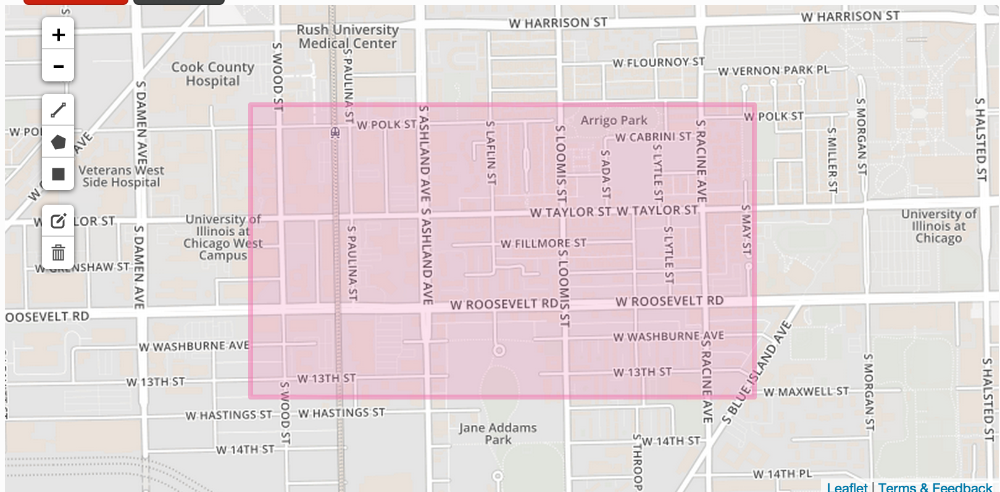

# Test Fixtures and Sources

## Shapefiles

* [chicago_city_limits.zip](https://data.cityofchicago.org/Facilities-Geographic-Boundaries/Boundaries-City/ewy2-6yfk): The boundaries of the City of Chicago. Just one big polygon in this dataset.

* chicago_city_limits_changed.zip: same data as chicago_city_limits, but with cosmetic changes to the .prj file.

* [chicago_zip_codes.zip](https://data.cityofchicago.org/Facilities-Geographic-Boundaries/Boundaries-ZIP-Codes/gdcf-axmw): Chicago divided into zip codes. One polygon per zip code.

* [chicago_pedestrian_streets.zip](https://data.cityofchicago.org/Transportation/Pedestrian-Streets/w3m8-5y6d): Chicago streets set aside for pedestrian use. One polyline per street.

## GeoJSON
* university_village_rectangle.json: GeoJSON of a rectangle over Chicago neighborhood University Village/Little Italy. Picked to intersect with three zip codes in chicago_zip_codes, contain one street in chicago_pedestrian_streets and intersect with one street in chicago_pedestrian_streets.

